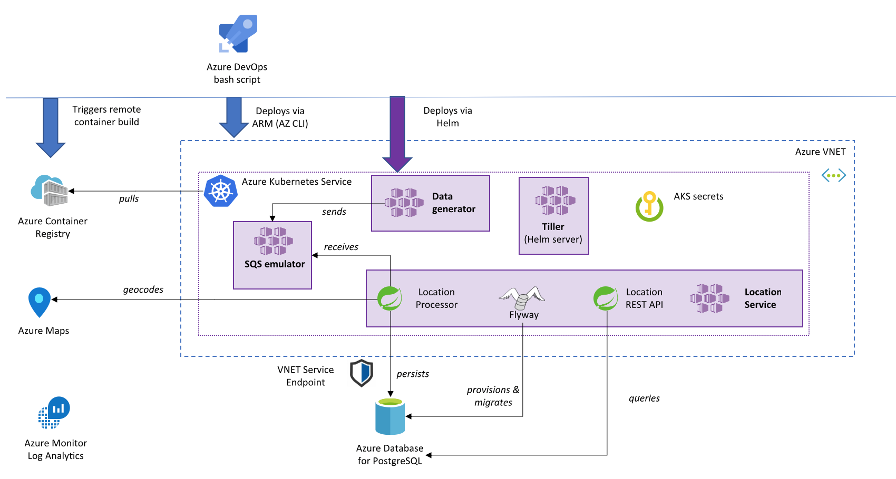

# Azure Kubernetes Service Spring Boot SQS data processor sample

This sample shows how to setup an end-to-end solution to implement a Spring Cloud application that processes data incoming from a messaging system in AWS and exposes it through a REST API.
There are *many* possible ways to implement such solution in Azure with different technologies, each one with its own pros and cons.

## Running the sample

Please note that the scripts have been tested on [Ubuntu 18 LTS](http://releases.ubuntu.com/18.04/), so make sure to use that environment to run the scripts. You can run it using Docker, WSL or a VM:

- [Ubuntu Docker Image](https://hub.docker.com/_/ubuntu/)
- [Windows 10 WSL](https://docs.microsoft.com/en-us/windows/wsl/install-win10)
- [WSL Ubuntu 18.04 LTS](https://www.microsoft.com/en-us/p/ubuntu-1804-lts/9n9tngvndl3q?activetab=pivot:overviewtab)
- [Ubuntu 18.04 LTS Azure VM](https://azuremarketplace.microsoft.com/en-us/marketplace/apps/Canonical.UbuntuServer1804LTS)

The following tools/languages are also needed:

- [Azure CLI](https://docs.microsoft.com/en-us/cli/azure/install-azure-cli-apt?view=azure-cli-latest)
  - Install: `sudo apt install azure-cli`
- [jq](https://stedolan.github.io/jq/download/)
  - Install: `sudo apt install jq`
- [helm](https://helm.sh/)
  - Install: `https://github.com/helm/helm`
- [kubectl](https://kubernetes.io/docs/reference/kubectl/overview/)
  - Install: `sudo apt-get install -y kubectl`

Just do a `git clone` of the repo and you'll be good to go.

## Architecture overview



### Infrastructure

The `create-solution.sh` script deploys and provisions the entire Azure infrastructure and environment within a newly created resource group, including:
* A Virtual Network to contain the Azure Kubernetes Service cluster and provide network isolation to the Azure PostgreSQL server.
* An Azure Database for PostgreSQL managed database service.
* An Azure Container Registry.
* An Azure Kubernetes Service cluster, configured with permissions to pull images from the Azure Container Registry.
* An Azure Log Analytics workspace, configured to receive logs and events from the Azure Kubernetes Service.
* An Azure Maps instance.

### Applications

In order to deploy a standalone solution on Azure, the script deploys an *SQS emulator* pod, [containerized Java implementation of the Amazon Simple Queue Service (AWS-SQS)](https://hub.docker.com/r/roribio16/alpine-sqs/) that is based on ElasticMQ and compatible with the AWS API.

The script deploys a *data generator* pod that sends around one JSON message per second to the SQS emulator.

The script builds and deploys a Spring Boot application, the *Location Service*, that contains several components:
* *[Flyway](https://flywaydb.org/)* scripts to perform database migrations (create a table in the database). Note that it is [safe](http://flywaydb.org/documentation/faq.html#parallel) to run Flyway multiple times concurrently from several pods in a deployment.
* The *Location Processor* consumes messages from SQS, calls Azure Maps to geocode the inbound `name`, and persists the result to the database.
* The *Location REST API* exposes data from the database.

## Inbound data

The script deploys a *data generator* pod that sends around one message per second to the SQS emulator in such a format, with a uniquely assigned `id`. The `name` field contains a string coming from the Linux Time Zone database, often a city but it may also be another geographical name or a time zone identifier such as `GMT+4`.

```json
{
    "id": "b81d241f-5187-40b0-ab2a-940faf9757c0",
    "name": "London"
}
```

## Persisted data

```
locationdb=> select * from location limit 10;
                  id                  |     name     |    country    | latitude | longitude 
--------------------------------------+--------------+---------------+----------+-----------
 debc18ab-5eb6-4101-8a81-3b68aa2693a6 | Ushuaia      | Argentina     | -54.7893 |  -68.2716
 54b5bbfe-9e55-4299-ae36-f97720f0886d | Troll        | Deutschland   |  48.4426 |   11.9818
 5d426214-8660-4160-bc84-67c684d2546f | Dakar        | Sénégal       |  14.6982 |  -17.4372
 f28d8906-aebf-4386-9567-fcea47367dcf | Maputo       | Mozambique    | -25.9732 |    32.572
 4743c041-7f83-4197-bc79-bb1e6ec974da | Tarawa       | Kiribati      |  1.33557 |    173.02
 38726f26-912f-42b8-8673-6d1b156146ce | Taipei       | Taiwan        |  25.0117 |   121.466
 a3b4028c-7c96-42db-8185-1e339a580701 | Alaska       | United States |  42.8401 |  -85.4783
 f69afde5-59b2-4787-a773-f5d9b686f6a1 | Acre         | Brasil        | -9.58975 |  -67.5331
 c238cb61-36ef-4f5a-b50f-7b5da6b7d067 | Antananarivo | Madagascar    | -18.9085 |   47.5375
 407c96fb-d98d-4519-8123-2885fc957c9e | Lima         | United States |  40.7427 |   -84.105
(10 rows)

```

## Component tests

The Location Service includes Spring Boot tests of the main components.

## Deploying the solution

Make sure you are logged into your Azure account:

    az login

and also make sure you have the subscription you want to use selected

    az account list

if you want to select a specific subscription use the following command

    az account set --subscription <subscription_name>

once you have selected the subscription you want to use just execute the following command

    ./create-solution.sh -d <solution_name>

then `solution_name` value will be used to create a resource group that will contain all resources created by the script. It will also be used as a prefix for all resource create so, in order to help to avoid name duplicates that will break the script, you may want to generate a name using a unique prefix. **Please also use only lowercase letters and numbers only**, since the `solution_name` is also used to create a storage account, which has several constraints on characters usage:

[Storage Naming Conventions and Limits](https://docs.microsoft.com/en-us/azure/architecture/best-practices/naming-conventions#storage)

to have an overview of all the supported arguments just run

    ./create-solution.sh

## Solution customization

If you want to change some setting of the solution, like the PostgreSQL server tier, size of the AKS cluster and so on, you can do it right in the `create-solution.sh` script, by changing any of these values:

export POSTGRESQL_SKU=GP_Gen5_2
export AKS_VM_SIZE=Standard_D2s_v3
export AKS_KUBERNETES_VERSION=1.14.7
export AKS_NODES=3

## Monitor performance

The solution includes primitive console reporting to verify data is coming through:

```
./create-solution.sh -d mysoln131
[...]
***** [M] Starting up MONITORING
Getting PostgreSQL endpoint
Starting monitoring
 Count of events in the database | 10672
 Count of events in the database | 10674
 Count of events in the database | 10677
```

## Query Data

Data is available in the created Cosmos DB database. You can query it from the portal, for example:

```sql
SELECT * FROM c WHERE c.type = 'CO2'
```

## Clean up

To remove all the created resource, you can just delete the related resource group

```bash
az group delete -n <resource-group-name>
```

## Troubleshooting

If the `create-solution.sh` script fails with an error, just rerun it. All actions are idempotent.

```
# Connect to PostgreSQL server. Replace ${PREFIX} with your solution name prefix.
kubectl run -it --rm --image=postgres mypostgres --command bash
psql -h postgres -U serveradmin@${PREFIX}sql locationdb
# The password is hard-coded in the `create-solution.sh` script.

# View logs of location service
k logs -l app=spring-app-spring-app --tail 1000 --follow
```

